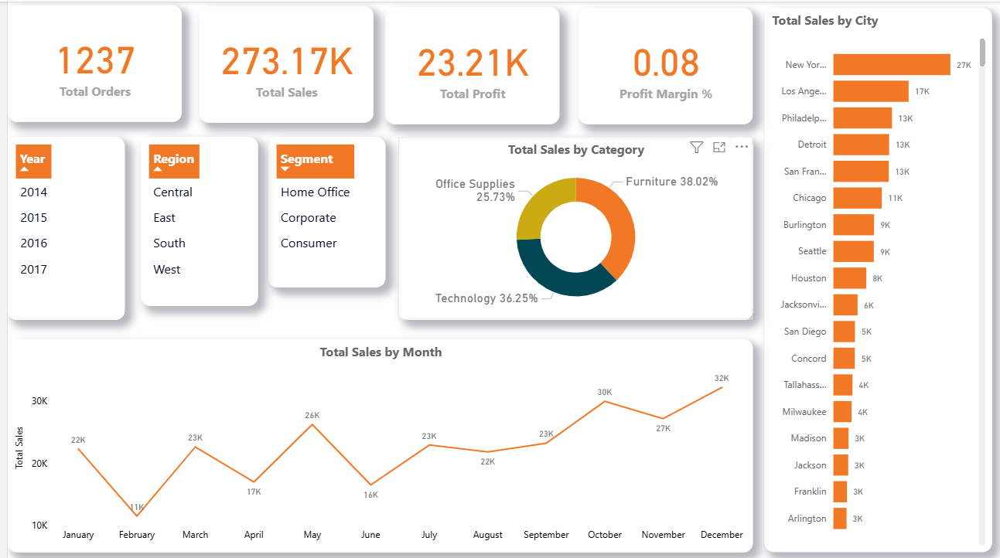
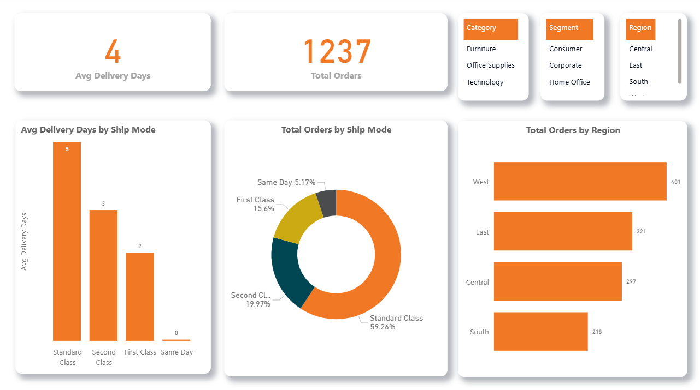
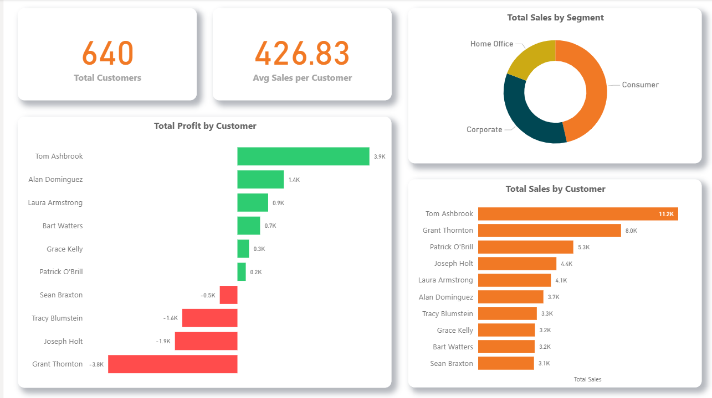

# 📊 Superstore Sales Analysis Dashboard

## 📖 Project Overview
This project presents a comprehensive Sales & Operations Dashboard built using Microsoft Power BI.  
The goal of this analysis is to uncover key insights related to sales performance, profitability, customer behavior, and shipping efficiency.

The dashboard transforms raw transactional data into actionable business insights through interactive visualizations and DAX calculations.

---

## 🎯 Business Objectives
- Analyze overall sales and profit performance
- Identify high-performing and underperforming products
- Evaluate customer contribution to revenue
- Assess shipping performance and operational efficiency
- Provide strategic recommendations based on insights

---

## 📂 Dashboard Pages

### 1️⃣ Executive Overview
- Total Sales
- Total Profit
- Total Orders
- Sales Trend Over Time
- Sales by Region
- Category Contribution

### 2️⃣ Product Performance
- Sales by Category & Sub-Category
- Profit by Product
- Identification of loss-making products
- Profit Margin Analysis

### 3️⃣ Customer Analysis
- Total Customers
- Top 10 Customers by Sales
- Profit by Customer
- Sales by Segment
- Average Sales per Customer

### 4️⃣ Shipping & Operations
- Average Delivery Time
- Orders by Ship Mode
- Delivery Performance by Shipping Method
- Regional Order Distribution

### 5️⃣ Business Insights & Recommendations
- Key performance observations
- Profitability risks
- Operational improvement suggestions
- Strategic growth opportunities

---

## 🔍 Key Insights

- Technology category generated the highest revenue.
- Some sub-categories show negative profit despite high sales.
- Standard Class is the most frequently used shipping mode.
- Certain regions outperform others in both sales and profitability.
- Discounts significantly impact profit margins.

---

## 🛠 Tools & Technologies Used

- Microsoft Power BI
- Power Query (Data Cleaning & Transformation)
- DAX (Data Analysis Expressions)
- Data Modeling
- Interactive Visualizations

---

## 📈 Key DAX Measures Created

- Total Sales
- Total Profit
- Total Orders
- Profit Margin
- Average Delivery Days
- Sales per Customer
- Order Percentage Calculation

---

## 🚀 How to Use

1. Download the `.pbix` file from this repository.
2. Open it using Microsoft Power BI Desktop.
3. Interact with slicers and visuals to explore insights.

---

## 📸 Dashboard Preview

Example:

---

## 💡 Strategic Recommendations

- Focus on high-margin products to improve profitability.
- Review pricing and discount strategies for loss-making products.
- Promote faster shipping options selectively.
- Target high-performing regions with increased marketing efforts.

---

## 👤 Author

Sajed Khan Abir  
Aspiring Data Analyst | Power BI Enthusiast  
